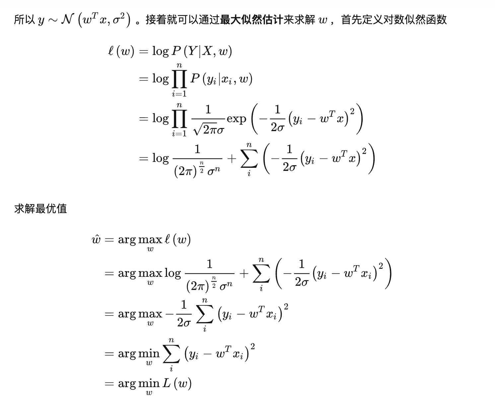

# OLS
- **If we duplicate the dataset, how will the beta change? How will the t-stats change? And why? If we want to get the correct t-stats, what should we do?**
  - beta unchange $\hat{\beta} = (X^TX )^{-1}X^T Y$ 
  - Var(beta) decrease thus Standard deviation(beta) decrease because duplication artificially inflates the sample size, making it appear     as if we have more information than we actually do.
  - t-statsitc = $\frac{beta}{Standard \ deviation}$, increase
  - increasing the chance of incorrectly rejecting the null hypothesis (Type I error).
  - t-statsitc increase, p-value decrease
  - To get correct t-statistics after duplicating the dataset, you could adjust the degrees of freedom used in your calculations to reflect the true sample size.
    
- **If the variance of the error term is different for each dataset, can we get the correct beta? Can we get the correct t-stat? And if we cannot, how can we get the correct beta and t-stat?**
  -  Heteroscedasticity does not cause bias in the coefficient estimates (betas) themselves in an Ordinary Least Squares (OLS) regression. Therefore, even in the presence of heteroscedasticity, your betas would still be correct under OLS estimation.
  -  However, heteroscedasticity does affect the standard errors of your coefficients. When heteroscedasticity is present, the standard errors from OLS are incorrect, leading to unreliable hypothesis tests (i.e., t-statistics, F-statistics) and confidence interv
  - Heteroscedasticity--GRACH
  - GLS, WLS

- **If there is a noise in x, and we can only observe x’=x+noise, the noise is unrelated with x, how will the beta change? What if the noise if in y, we can only observe y’= y+noise?**
  
- **For OLS, if the correlation coefficient between two variables is 0.999, what is R^2?**
    - (0.999)^2
       
- **Simple linear regression y = beta1*x1+b1, adding feature x2, get bivariate regression y = beta1*x1 + beta2*x2 + b2, how would the variance of beta1 change?**
  
- **Here is the regression: y=1+x1+x2. If x1 and x2 are correlated, we just want to measure the impact of x2 on y, how should we do?
  - first regress x2 on x1 get the residual, and regress y on x1 and residual**
  
- **OLS with y ~ x1 + x2, the goodness of fit is very good, but the significance for the regression coefficient of both x1 and x2 are not good. What could be the cause and how to deal with it? (Pont72)**
  
- **OLS with y ~ x, how does high autocorrelation affect the coefficients for x and how does it affect the t statistics? (Point72)**

   - The estimated variance of the regression coefficients will be greater than the variances of estimate calculated by other methods.     Therefore, hypothesis testing is no longer valid. In most of the cases, $R^2$ will be overestimated (indicating a better fit than the one that truly exists). The t- statistics will tend to be higher.

- **If the regression coefficient b of y \~bx equals to 1, what's the range of the regression coefficient c of x\~cy? (Squarepoint)**
  
- **How to do weighted lasso regression? (2sigma)**
  
- **x1 and x2 are uncorrelated and having zero mean. We calculate the regression coefficients y-x1 ~ b'2 * x2 and y-x2 ~ b'1 * x1. Also we calculate the regression coefficients using the regular way y ~ b1 * x1 and y ~ b2 * x2. How are the coefficients (b1, b2) related to the coefficients (b'1, b'2)? (2sigma)**

- **Show OLS estimate is MLE under certain assumptions**
  - [回字的四种写法——从线性回归到贝叶斯线性回归](https://zhuanlan.zhihu.com/p/86009986)
  - 
  
- **OLS is BLUE assumtions**
   - Guassian- Markov

- **How to prove that the R square will never decrease.**
   - If we set the coefficients to be 0 in all the new features, we can get the same R2. And the final R2 can only be larger.
     
- **Can you give me the R square formula given the correlation matrix of Y and X1 , X2?**
    - $R^2 = 1 - (SS_res / SS_tot)$
    -[Coefficient of multiple correlation](https://en.wikipedia.org/wiki/Coefficient_of_multiple_correlation)

- **Linear model only with variable X1 to predict Y error is E1, only variable X2 prediction error of Y is the E2, if use the X1 and X2 to predict Y error range is how much.**
   - [0,min(E1, E2)]. You can do it using equations in 4, and when E is 0, X1, X2 and Y are on the same two dimensional space. Or you can think it as a problem of vectors on a plane.
     
-** Tell me about what is leverage? How to use it? **
  - leverage is a measure of how far away the independent variable values of an observation are from those of the other observations.
  - High leverage points can have an exaggerated effect on the estimate of the regression coefficients

# Ridge and Lasso
- **What are the Bayesian interpretation of Ridge and Lesso regression?**
  - (https://ekamperi.github.io/mathematics/2020/08/02/bayesian-connection-to-lasso-and-ridge-regression.html)
    
- **What is the prior distribution of beta for ridge regression and lasso regression?**
  - Ridge is Gaussian lasso is double exp distribution

- **How to use a blackbox that can do vanilla regression to do Ridge regression?**
    - Adding a random unit noise with $\sqrt \lambda $
    - (http://madrury.github.io/jekyll/update/statistics/2017/08/12/noisy-regression.html)

- **In ridge regression, if m copies of a variable x are included, what will happen to the coefficient?**
  
- **What is the solution for ridge regression? If we have perfect co-linearity, what will ridge regression return?**
  - $\hat{\beta} = (X^TX + \lambda I)^{-1}X^T Y$ 
  
- **What is the difference between ridge and lasso**? 
    - Ridge Regression (also known as L2 regularization): It adds the squared magnitude of coefficient as the penalty term to the loss function.
        -  $Loss = OLS Loss + λ* Σ (β_j^2)$
    -  Lasso Regression (also known as L1 regularization): It adds the absolute value of the magnitude of coefficient as penalty term to the loss function.
        -  $Loss = OLS Loss + λ* Σ |β_j|$
       
    - [Lasso回归算法](https://blog.csdn.net/sai_simon/article/details/122359015?spm=1001.2014.3001.5502)
    - [岭回归算法](https://blog.csdn.net/sai_simon/article/details/122337097?spm=1001.2014.3001.5502)
      
- When should we use Ridge and when should we use Lasso?
   - Ridge Regression is generally a good choice when we have a lot of predictors that are likely to be related to the outcome. This is because Ridge will include all of them in the model but shrink their coefficients, which can lead to a better predictive model. (shrink to 0 but not 0)

  - Lasso Regression is useful when we have a high number of predictors and we believe that only a subset of them are actually related to the outcome. This is because Lasso can exclude non-useful predictors by setting their coefficients to zero
  - 
- The bias and variance of ridge and lasso.

- Why does the shrinkage method perform better than OLS?
  
- Do we include the intercept term in ridge/lasso regression? Why?

#  F statistics and T-statistics and Chi-Square
- How do you interpret F statistics?
- How do you interpret T statistics?
- How do you interpret Chi-Square?
- What's p-value

- **t-stats** (t-statistics): In statistical hypothesis testing, t-statistics measure the significance of an estimated parameter in relation to its standard error. It quantifies the difference between the estimated parameter and a hypothesized value, relative to the uncertainty in the estimation. A higher absolute t-statistic indicates a larger deviation from the hypothesized value and suggests a more significant relationship or effect.

-**F-stats** (F-statistics): F-statistics are used in statistical tests, such as analysis of variance (ANOVA) or regression analysis, to assess the overall significance of a set of coefficients or the overall fit of a model. It compares the variability explained by the model (explained sum of squares) to the unexplained variability (residual sum of squares). A higher F-statistic indicates a better fit or more significant relationship.

-**Chi-square** (χ²): Chi-square is a statistical test used to determine the association or independence between two categorical variables. It compares the observed frequencies in a contingency table with the frequencies expected under the assumption of independence. A higher chi-square value indicates a stronger association between the variables, while a lower value suggests independence.

-**p-value**: The p-value is a measure of the evidence against a null hypothesis in statistical hypothesis testing. It represents the probability of obtaining a test statistic as extreme or more extreme than the observed result, assuming the null hypothesis is true. A smaller p-value indicates stronger evidence against the null hypothesis, suggesting that the observed result is unlikely to occur by chance. Typically, if the p-value is below a predetermined significance level (e.g., 0.05), the null hypothesis is rejected in favor of the alternative hypothesis.

These statistical measures play crucial roles in hypothesis testing, model assessment, and determining the significance of relationships or effects in data analysis.

